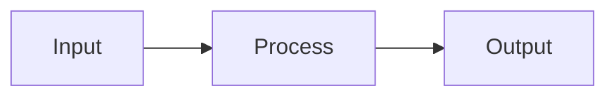

# Engineering Notebook

> A personal knowledge base and engineering notebook for CS — covering operating systems,
> machine learning, mathematics, Java, systems programming, and Linux.

[](https://github.com/yourusername/engineering-notebook/actions/workflows/deploy.yml)

**Live site:** https://yourusername.github.io/engineering-notebook

---

## What This Is

A public, searchable, dark-mode engineering notebook built with Docusaurus.
Notes are written as derivations + explanations, not just bullet points.

**Features:**
- 📐 KaTeX math rendering (inline and display)
- 🔷 Mermaid diagrams (flowcharts, state machines, sequence diagrams)
- 💻 Syntax highlighting for 15+ languages
- 🔍 Full-text local search (no Algolia needed)
- 🌙 Dark mode by default
- 📱 Mobile responsive
- 🏷️ Tags and categories
- 📡 RSS feed for the learning log
- 🚀 Auto-deploys on every push to `main`

---

## Knowledge Domains

| Domain | Notes |
|---|---|
| 📐 Mathematics | Linear algebra, calculus, probability, discrete math |
| ⚙️ Operating Systems | Processes, memory, scheduling, file systems, concurrency |
| 🧠 Machine Learning | Gradient descent, neural networks, backpropagation, regularization |
| ☕ Java | JVM, concurrency, generics, collections, design patterns |
| 🔧 Systems Programming | Memory layout, system calls, C/C++/Rust |
| 🐧 Linux | Filesystem, shell scripting, process management, networking |

---

## Tech Stack

| Component | Tool |
|---|---|
| Framework | [Docusaurus 3](https://docusaurus.io/) |
| Hosting | [GitHub Pages](https://pages.github.com/) (free) |
| Math | [KaTeX](https://katex.org/) via remark-math |
| Diagrams | [Mermaid](https://mermaid.js.org/) |
| Search | [@easyops-cn/docusaurus-search-local](https://github.com/easyops-cn/docusaurus-search-local) |
| CI/CD | [GitHub Actions](https://github.com/features/actions) |

---

## Local Development

### Prerequisites

- Node.js >= 18
- npm >= 9

### Setup

```bash
# Clone the repo
git clone https://github.com/yourusername/engineering-notebook.git
cd engineering-notebook

# Install dependencies
npm install

# Start dev server (http://localhost:3000)
npm start
```

### Build

```bash
npm run build        # Build static site → ./build/
npm run serve        # Preview the built site locally
```

---

## Writing Notes

### Create a new note

```bash
# Inside the relevant docs subdirectory
touch docs/machine-learning/transformer-architecture.md
```

### Note frontmatter template

```markdown
---
id: transformer-architecture
title: Transformer Architecture
description: Self-attention, positional encoding, and the encoder-decoder stack.
tags: [ml, transformers, attention, advanced]
last_update:
  date: 2024-01-30
  author: Your Name
---
```

### Naming convention

```
{topic}-{subtopic}.md

Examples:
  gradient-descent.md
  process-management.md
  linear-algebra-fundamentals.md
  jvm-internals.md
```

### Math (KaTeX)

```markdown
Inline: $E = mc^2$

Display:
$$
\nabla_\theta J(\theta) = \frac{1}{m} X^T (X\theta - y)
$$
```

### Mermaid diagrams

````markdown

````

### Code blocks

````markdown
```java title="Counter.java"
public class Counter {
    private final AtomicInteger count = new AtomicInteger(0);
    public void increment() { count.incrementAndGet(); }
}
```
````

---

## Deployment

Deployment is **fully automatic** via GitHub Actions. On every push to `main`:
1. The site is built
2. Deployed to GitHub Pages

**One-time setup:**
1. In your GitHub repo: **Settings → Pages → Source → GitHub Actions**
2. Push to `main`

That's it. The site deploys in ~2 minutes.

---

## Tagging Strategy

Every note uses at least:
- **Domain tag:** `mathematics`, `os`, `ml`, `java`, `systems`, `linux`
- **Concept tag:** `gradient-descent`, `process`, `matrix`, etc.
- **Difficulty tag:** `beginner`, `intermediate`, `advanced`

Browse all tags at: `/docs/tags`

---

## Custom Domain (Optional)

1. Add `CNAME` file to `static/` directory: `echo "notes.yourdomain.com" > static/CNAME`
2. Update `url` in `docusaurus.config.js` to `https://notes.yourdomain.com`
3. Update `baseUrl` to `/`
4. In GitHub: **Settings → Pages → Custom Domain** → enter your domain
5. Add a CNAME DNS record at your registrar pointing to `yourusername.github.io`

---

## Future Roadmap

- [ ] AI-powered semantic search (embeddings + vector DB)
- [ ] Personal knowledge graph visualisation
- [ ] Spaced repetition system (Anki-style cards from notes)
- [ ] Automatic backlinking between related notes
- [ ] Interactive code execution (via Sandpack or CodeSandbox)

---

## License

Content (notes) © Your Name — All rights reserved.
Code (configuration, theme) — MIT License.
