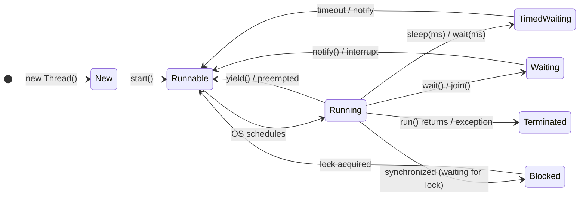
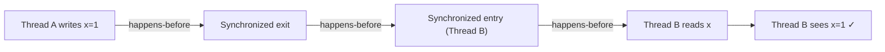

# Java Concurrency Basics

Concurrency is where most Java bugs hide. This note covers the foundational model —
from threads to the Java Memory Model — with emphasis on the **why**, not just the API.

## 1. Threads in Java

A **thread** is a lightweight unit of execution within a process. All threads in a JVM share
the same heap but each has its own **stack**, **program counter**, and **local variables**.

### Creating Threads

```java
// Option 1: Extend Thread (not preferred — couples task and mechanism)
class MyThread extends Thread {
    @Override
    public void run() {
        System.out.println("Running in: " + Thread.currentThread().getName());
    }
}

// Option 2: Implement Runnable (preferred — separates task from thread)
Runnable task = () -> System.out.println("Lambda task: " + Thread.currentThread().getName());

// Option 3: Use ExecutorService (production standard — manages thread pools)
ExecutorService executor = Executors.newFixedThreadPool(4);
executor.submit(() -> System.out.println("Pooled thread"));
executor.shutdown();
```

:::tip Always prefer ExecutorService over raw threads
Raw `Thread` creation has overhead and is hard to manage at scale.
`ExecutorService` handles thread lifecycle, pooling, and graceful shutdown.
:::

### Thread Lifecycle



---

## 2. The Race Condition Problem

```java
public class Counter {
    private int count = 0;  // shared mutable state

    public void increment() {
        count++;  // NOT atomic! Expands to: read, increment, write
    }

    public int get() { return count; }
}
```

If two threads call `increment()` simultaneously, both may:
1. Read `count = 5`
2. Both compute `5 + 1 = 6`
3. Both write `6`

Result: counter is `6` instead of `7`. This is a **race condition** — a bug that depends
on thread interleaving and is non-deterministic.

---

## 3. The `synchronized` Keyword

`synchronized` ensures **mutual exclusion** — only one thread can hold the monitor lock at a time.

### Method-level synchronization

```java
public class SafeCounter {
    private int count = 0;

    // Entire method is a critical section — lock is 'this'
    public synchronized void increment() {
        count++;
    }

    public synchronized int get() {
        return count;
    }
}
```

### Block-level synchronization (preferred — minimizes lock scope)

```java
public class SafeCounter {
    private int count = 0;
    private final Object lock = new Object(); // explicit lock object

    public void increment() {
        // Only the critical section is locked
        synchronized (lock) {
            count++;
        }
        // Other non-critical work happens here without holding the lock
    }
}
```

:::warning Lock scope matters
Holding a lock longer than necessary reduces **throughput** — other threads are
blocked waiting. Always minimize the critical section.
:::

---

## 4. The `volatile` Keyword

`volatile` solves a different (but related) problem: **visibility**.

Without `volatile`, the JVM may cache a variable's value in a CPU register or L1 cache.
Threads may see stale values.

```java
public class FlagExample {
    // Without volatile: thread2 may never see the flag change
    // because it reads from its cache
    private volatile boolean running = true;

    public void stop() {
        running = false;  // written to main memory immediately
    }

    public void loop() {
        while (running) {  // always reads from main memory
            doWork();
        }
    }
}
```

### volatile vs. synchronized — When to Use Which

| Scenario | Tool |
|---|---|
| Single write, multiple reads | `volatile` |
| Read-modify-write (e.g., `count++`) | `synchronized` or `AtomicInteger` |
| Complex invariants involving multiple variables | `synchronized` |
| Maximum performance with atomic ops | `java.util.concurrent.atomic.*` |

---

## 5. The Java Memory Model (JMM)

The JMM defines when writes by one thread are **visible** to reads by another.

Key concept: **happens-before relationship**. If action A happens-before action B,
then A's effects are visible to B.



**Happens-before rules:**
1. Within a thread: each action happens-before the next
2. `synchronized`: unlock happens-before lock on same monitor
3. `volatile`: write happens-before subsequent reads
4. `Thread.start()`: all actions before start() happen-before any action in the thread
5. `Thread.join()`: all actions in the thread happen-before join() returns

---

## 6. `java.util.concurrent` — The Right Tools

| Problem | Wrong Tool | Right Tool |
|---|---|---|
| Counter | `int` + `synchronized` | `AtomicInteger` |
| Thread-safe list | `synchronized` ArrayList | `CopyOnWriteArrayList` or `ConcurrentLinkedQueue` |
| Thread-safe map | `Hashtable` (slow) | `ConcurrentHashMap` |
| Run once at start | `boolean` flag | `CountDownLatch` |
| Rate limiting | busy-wait | `Semaphore` |
| Reusable barriers | `synchronized wait/notify` | `CyclicBarrier` |

```java
import java.util.concurrent.*;
import java.util.concurrent.atomic.*;

// Atomic counter — lock-free, faster than synchronized
AtomicInteger atomicCount = new AtomicInteger(0);
atomicCount.incrementAndGet();  // thread-safe increment

// ConcurrentHashMap — fine-grained locking per bucket
Map<String, Integer> map = new ConcurrentHashMap<>();
map.put("key", 1);
map.computeIfAbsent("key2", k -> expensiveCompute(k));

// CountDownLatch — wait for N threads to complete
CountDownLatch latch = new CountDownLatch(3);

for (int i = 0; i < 3; i++) {
    executor.submit(() -> {
        doWork();
        latch.countDown();  // signal completion
    });
}

latch.await();  // main thread blocks until all 3 are done
System.out.println("All threads finished");
```

---

## 7. Deadlock

A **deadlock** occurs when two or more threads wait for each other forever.

```java
// Classic deadlock — two threads, two locks, opposite order
Object lockA = new Object();
Object lockB = new Object();

Thread t1 = new Thread(() -> {
    synchronized (lockA) {              // t1 holds A, waits for B
        synchronized (lockB) { doWork(); }
    }
});

Thread t2 = new Thread(() -> {
    synchronized (lockB) {              // t2 holds B, waits for A
        synchronized (lockA) { doWork(); }
    }
});
```

**Deadlock conditions (all four must hold simultaneously):**
1. **Mutual exclusion** — resources cannot be shared
2. **Hold and wait** — thread holds one resource while requesting another
3. **No preemption** — resources cannot be forcibly taken
4. **Circular wait** — circular chain of threads waiting for each other

**Prevention strategy:** Always acquire locks in the **same global order**.

```java
// Deadlock-free: always lock A then B, never B then A
Thread t1 = new Thread(() -> { synchronized (lockA) { synchronized (lockB) { doWork(); } } });
Thread t2 = new Thread(() -> { synchronized (lockA) { synchronized (lockB) { doWork(); } } });
```

---

## Summary

| Concept | Purpose | Risk if Misused |
|---|---|---|
| `synchronized` | Mutual exclusion + visibility | Deadlock, contention |
| `volatile` | Visibility only | Race conditions (not atomic) |
| `AtomicInteger` | Lock-free atomic ops | Complex multi-variable invariants |
| `ReentrantLock` | Flexible locking (tryLock, timeout) | Must unlock in `finally` |
| `ExecutorService` | Thread pool management | Must call shutdown() |

## Related Notes

- Operating system deadlocks and concurrency (planned) — the OS-level view
- JVM internals (planned) — how the Java Memory Model is implemented
- Java collections framework (planned) — thread-safe collections
