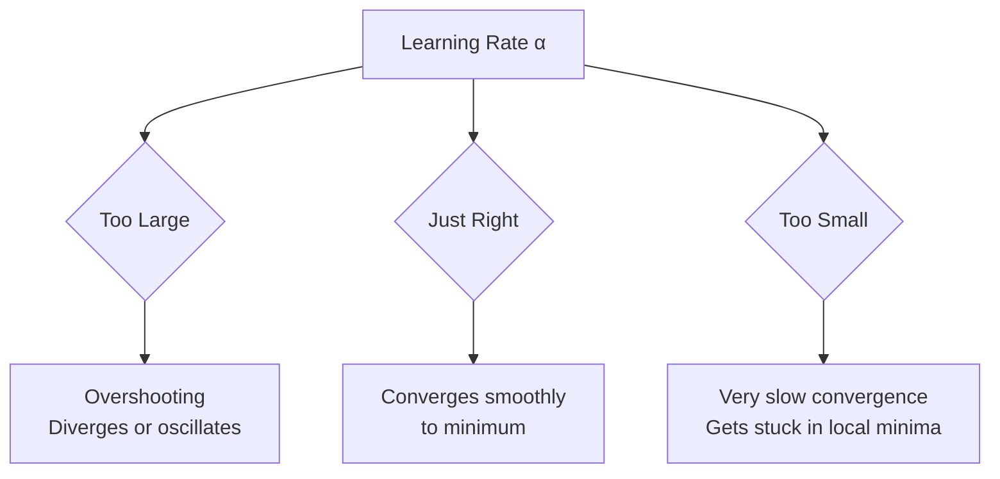

# Gradient Descent — Full Derivation

Gradient descent is the engine of virtually all machine learning. Understanding it from first
principles — not just the update rule — is essential for debugging training and understanding
why deep learning works.

## 1. The Optimization Problem

Machine learning training is an optimization problem. Given:
- A **model** $f(\mathbf{x}; \theta)$ parameterized by $\theta$
- A **dataset** $\{(\mathbf{x}^{(i)}, y^{(i)})\}_{i=1}^{m}$
- A **loss function** $\mathcal{L}(\hat{y}, y)$ measuring prediction error

We want to find $\theta^*$ that minimizes the **cost function** $J(\theta)$:

$$J(\theta) = \frac{1}{m} \sum_{i=1}^{m} \mathcal{L}(f(\mathbf{x}^{(i)}; \theta),\ y^{(i)})$$

For linear regression with MSE loss:
$$J(\theta) = \frac{1}{2m} \sum_{i=1}^{m} (h_\theta(\mathbf{x}^{(i)}) - y^{(i)})^2$$

(The $\frac{1}{2}$ is a convenience factor that cancels with the derivative's $2$.)

---

## 2. Why Gradient?

The gradient $\nabla_\theta J(\theta)$ is a vector pointing in the direction of **steepest ascent**
of $J$ with respect to $\theta$.

To **minimize** $J$, we move in the **opposite direction** of the gradient.

This comes from the first-order Taylor expansion of $J$ around $\theta$:

$$J(\theta + \delta) \approx J(\theta) + \delta^T \nabla_\theta J(\theta)$$

To make $J(\theta + \delta) < J(\theta)$, we need $\delta^T \nabla_\theta J(\theta) < 0$.

The choice $\delta = -\alpha \nabla_\theta J(\theta)$ (for $\alpha > 0$) gives:

$$\delta^T \nabla_\theta J(\theta) = -\alpha \|\nabla_\theta J(\theta)\|^2 \leq 0$$

Always negative (decreasing $J$) unless we are at a critical point where $\nabla_\theta J = \mathbf{0}$.

---

## 3. The Update Rule

The **gradient descent update** at iteration $t$:

$$\boxed{\theta_{t+1} = \theta_t - \alpha \nabla_{\theta} J(\theta_t)}$$

where $\alpha > 0$ is the **learning rate** (step size).

### Derivation for Linear Regression

With $h_\theta(\mathbf{x}) = \theta^T \mathbf{x}$:

$$J(\theta) = \frac{1}{2m} \sum_{i=1}^{m} (\theta^T \mathbf{x}^{(i)} - y^{(i)})^2$$

Take the partial derivative with respect to $\theta_j$:

$$\frac{\partial J}{\partial \theta_j} = \frac{1}{m} \sum_{i=1}^{m} (\theta^T \mathbf{x}^{(i)} - y^{(i)}) \cdot x_j^{(i)}$$

In matrix form ($\mathbf{X} \in \mathbb{R}^{m \times n}$, $\mathbf{y} \in \mathbb{R}^m$):

$$\nabla_\theta J = \frac{1}{m} \mathbf{X}^T (\mathbf{X}\theta - \mathbf{y})$$

Update rule:

$$\theta := \theta - \frac{\alpha}{m} \mathbf{X}^T (\mathbf{X}\theta - \mathbf{y})$$

---

## 4. Learning Rate Effects

The learning rate $\alpha$ is the most critical hyperparameter.



| Learning Rate | Behaviour | Fix |
|---|---|---|
| Too large ($\alpha \gg 0.1$) | Loss explodes or oscillates | Reduce $\alpha$ by 10× |
| Too small ($\alpha \ll 10^{-4}$) | Extremely slow convergence | Increase $\alpha$ or use adaptive rates |
| Just right | Smooth, fast decrease | ✅ |

### Learning Rate Schedule

Instead of a fixed $\alpha$, decay it over time:

**Step decay:** $\alpha_t = \alpha_0 \cdot \gamma^{\lfloor t/k \rfloor}$ (e.g., halve every 10 epochs)

**Cosine annealing:** $\alpha_t = \alpha_{min} + \frac{1}{2}(\alpha_{max} - \alpha_{min})(1 + \cos(\frac{t\pi}{T}))$

---

## 5. Variants of Gradient Descent

| Variant | Data Used Per Update | Pros | Cons |
|---|---|---|---|
| **Batch GD** | All $m$ examples | Stable gradient, guaranteed convergence | Slow for large $m$ |
| **Stochastic GD (SGD)** | 1 example | Fast updates, can escape local minima | Noisy, oscillates |
| **Mini-batch GD** | $k$ examples (e.g., 32, 64) | Balance of both | Requires tuning batch size |

Mini-batch is what is almost always meant in practice when people say "SGD".

```python
import numpy as np

def mini_batch_gradient_descent(X, y, alpha=0.01, batch_size=32, epochs=100):
    m, n   = X.shape
    theta  = np.zeros(n)
    losses = []

    for epoch in range(epochs):
        # Shuffle data at each epoch
        indices = np.random.permutation(m)
        X_shuffled, y_shuffled = X[indices], y[indices]

        epoch_loss = 0
        for start in range(0, m, batch_size):
            X_batch = X_shuffled[start:start + batch_size]
            y_batch = y_shuffled[start:start + batch_size]

            # Forward pass
            y_pred = X_batch @ theta

            # Compute gradient
            error = y_pred - y_batch
            grad  = (1 / len(y_batch)) * X_batch.T @ error

            # Update
            theta -= alpha * grad
            epoch_loss += np.mean(error**2)

        losses.append(epoch_loss / (m // batch_size))

    return theta, losses
```

---

## 6. Adaptive Optimizers

Fixed learning rates are often suboptimal. Adaptive methods maintain a per-parameter
learning rate:

### Adam (Adaptive Moment Estimation)

Adam combines momentum (1st moment) and RMSProp (2nd moment):

$$m_t = \beta_1 m_{t-1} + (1 - \beta_1) g_t \quad \text{(1st moment — exponential avg of gradients)}$$
$$v_t = \beta_2 v_{t-1} + (1 - \beta_2) g_t^2 \quad \text{(2nd moment — exponential avg of squared gradients)}$$

Bias correction (because $m_0 = v_0 = 0$):

$$\hat{m}_t = \frac{m_t}{1 - \beta_1^t}, \quad \hat{v}_t = \frac{v_t}{1 - \beta_2^t}$$

Update:
$$\theta_{t+1} = \theta_t - \frac{\alpha}{\sqrt{\hat{v}_t} + \epsilon} \hat{m}_t$$

Default hyperparameters: $\beta_1 = 0.9$, $\beta_2 = 0.999$, $\epsilon = 10^{-8}$.

:::tip Why Adam works so well
Parameters with consistently large gradients get a smaller effective learning rate
(denominator $\sqrt{\hat{v}_t}$ is large). Parameters with small gradients get a
larger effective rate. This automatic scaling handles sparse gradients and different
parameter scales without manual tuning.
:::

```python
# Using Adam in PyTorch
import torch
import torch.nn as nn

model     = nn.Linear(10, 1)
optimizer = torch.optim.Adam(model.parameters(), lr=1e-3, betas=(0.9, 0.999))
criterion = nn.MSELoss()

for epoch in range(100):
    optimizer.zero_grad()        # Clear gradients
    output = model(X_train)      # Forward pass
    loss   = criterion(output, y_train)
    loss.backward()              # Backprop — compute gradients
    optimizer.step()             # Update θ
```

---

## 7. Convergence Conditions

Gradient descent is guaranteed to converge to a **global minimum** if:
1. $J(\theta)$ is **convex** (no local minima)
2. Learning rate satisfies the **Robbins-Monro conditions**: $\sum \alpha_t = \infty$ and $\sum \alpha_t^2 < \infty$

For non-convex functions (like deep networks), gradient descent finds a **local minimum** or a
**saddle point** — in practice, for overparameterized networks, these local minima are often
"good enough".

---

## Summary

$$\theta_{t+1} = \theta_t - \alpha \underbrace{\nabla_\theta J(\theta_t)}_{\text{direction of steepest descent}}$$

Key points:
- Gradient points **uphill** → subtract to go **downhill**
- Learning rate $\alpha$ controls step size — critical hyperparameter
- Mini-batch GD is the practical default
- Adaptive optimizers (Adam) handle varying gradient scales automatically

## Related Notes

- [Linear Algebra Fundamentals](/docs/mathematics/linear-algebra-fundamentals) — vectors and matrices used here
- [Neural Networks Basics](/docs/machine-learning/neural-networks-basics) — where this is applied
- [Backpropagation](/docs/machine-learning/backpropagation) — computing $\nabla_\theta J$ for neural nets
