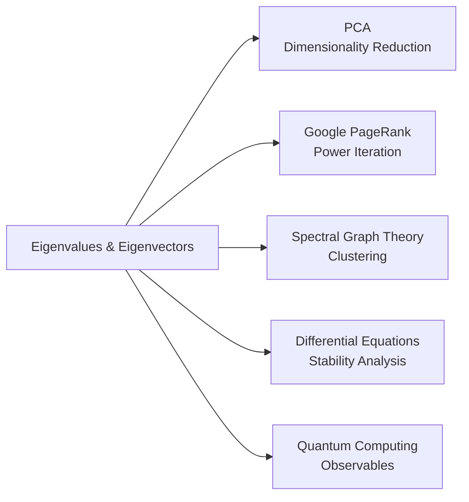

# Linear Algebra Fundamentals

Linear algebra is the backbone of machine learning, computer graphics, and many CS algorithms.
This note covers the key concepts with full derivations — no hand-waving.

## 1. Vectors

A **vector** in $\mathbb{R}^n$ is an ordered tuple of $n$ real numbers:

$$
\mathbf{v} = \begin{bmatrix} v_1 \\ v_2 \\ \vdots \\ v_n \end{bmatrix}
$$

### Vector Operations

**Addition:**
$$\mathbf{u} + \mathbf{v} = \begin{bmatrix} u_1 + v_1 \\ u_2 + v_2 \\ \vdots \\ u_n + v_n \end{bmatrix}$$

**Scalar multiplication:**
$$c\mathbf{v} = \begin{bmatrix} cv_1 \\ cv_2 \\ \vdots \\ cv_n \end{bmatrix}$$

**Dot product:**
$$\mathbf{u} \cdot \mathbf{v} = \sum_{i=1}^{n} u_i v_i = \mathbf{u}^T \mathbf{v}$$

The dot product has a geometric interpretation:
$$\mathbf{u} \cdot \mathbf{v} = \|\mathbf{u}\| \|\mathbf{v}\| \cos\theta$$

where $\theta$ is the angle between $\mathbf{u}$ and $\mathbf{v}$.

:::tip Key Insight
If $\mathbf{u} \cdot \mathbf{v} = 0$, the vectors are **orthogonal** (perpendicular).
This is fundamental to PCA, QR decomposition, and neural network weight initialisation.
:::

**L2 Norm (Euclidean length):**
$$\|\mathbf{v}\|_2 = \sqrt{\mathbf{v} \cdot \mathbf{v}} = \sqrt{\sum_{i=1}^{n} v_i^2}$$

---

## 2. Matrices

A matrix $A \in \mathbb{R}^{m \times n}$ has $m$ rows and $n$ columns:

$$
A = \begin{bmatrix}
a_{11} & a_{12} & \cdots & a_{1n} \\
a_{21} & a_{22} & \cdots & a_{2n} \\
\vdots & \vdots & \ddots & \vdots \\
a_{m1} & a_{m2} & \cdots & a_{mn}
\end{bmatrix}
$$

### Matrix Multiplication

For $A \in \mathbb{R}^{m \times k}$ and $B \in \mathbb{R}^{k \times n}$, the product $C = AB \in \mathbb{R}^{m \times n}$ is:

$$C_{ij} = \sum_{r=1}^{k} A_{ir} B_{rj}$$

**Important:** $AB \neq BA$ in general — matrix multiplication is **not commutative**.

```python
import numpy as np

A = np.array([[1, 2], [3, 4]])
B = np.array([[5, 6], [7, 8]])

C = A @ B   # Matrix multiply (preferred over np.dot for clarity)
# C = [[19, 22],
#      [43, 50]]

print(A @ B)  # Not equal to B @ A
print(B @ A)
```

### Special Matrices

| Matrix Type | Property | Example |
|---|---|---|
| Identity $I$ | $AI = IA = A$ | $\begin{bmatrix} 1 & 0 \\ 0 & 1 \end{bmatrix}$ |
| Diagonal | Off-diag elements = 0 | $\begin{bmatrix} 3 & 0 \\ 0 & 5 \end{bmatrix}$ |
| Symmetric | $A = A^T$ | $\begin{bmatrix} 1 & 2 \\ 2 & 4 \end{bmatrix}$ |
| Orthogonal | $A^T = A^{-1}$, i.e., $A^TA = I$ | Rotation matrices |

---

## 3. Determinants

The **determinant** $\det(A)$ (or $|A|$) of a square matrix measures how a linear transformation
scales area (2D), volume (3D), or hypervolume (nD).

**2×2 determinant:**
$$\det\begin{bmatrix} a & b \\ c & d \end{bmatrix} = ad - bc$$

**3×3 determinant** (cofactor expansion along row 1):
$$\det(A) = a_{11}(a_{22}a_{33} - a_{23}a_{32}) - a_{12}(a_{21}a_{33} - a_{23}a_{31}) + a_{13}(a_{21}a_{32} - a_{22}a_{31})$$

:::note Geometric meaning
- $|\det(A)| = 1$: the transformation preserves area/volume.
- $\det(A) = 0$: the matrix is **singular** (not invertible; columns are linearly dependent).
- $\det(A) < 0$: the transformation includes a reflection.
:::

---

## 4. Eigenvalues and Eigenvectors

An **eigenvector** $\mathbf{v}$ of matrix $A$ satisfies:

$$A\mathbf{v} = \lambda\mathbf{v}$$

where $\lambda$ is the corresponding **eigenvalue**. In plain English:
multiplying by $A$ only **scales** $\mathbf{v}$, it doesn't change its direction.

### Derivation — Finding Eigenvalues

Rearrange $A\mathbf{v} = \lambda\mathbf{v}$:

$$A\mathbf{v} - \lambda\mathbf{v} = \mathbf{0}$$
$$(A - \lambda I)\mathbf{v} = \mathbf{0}$$

For a non-trivial solution ($\mathbf{v} \neq \mathbf{0}$), the matrix $(A - \lambda I)$ must be
**singular**, so:

$$\det(A - \lambda I) = 0$$

This is the **characteristic equation**. Solve it to find the eigenvalues, then substitute each
$\lambda$ back to find the corresponding eigenvectors.

### Worked Example

$$A = \begin{bmatrix} 4 & 1 \\ 2 & 3 \end{bmatrix}$$

**Step 1 — Characteristic equation:**

$$\det(A - \lambda I) = \det\begin{bmatrix} 4-\lambda & 1 \\ 2 & 3-\lambda \end{bmatrix} = 0$$

$$(4-\lambda)(3-\lambda) - (1)(2) = 0$$
$$\lambda^2 - 7\lambda + 12 - 2 = 0$$
$$\lambda^2 - 7\lambda + 10 = 0$$
$$(\lambda - 5)(\lambda - 2) = 0$$

So $\lambda_1 = 5$, $\lambda_2 = 2$.

**Step 2 — Eigenvector for $\lambda_1 = 5$:**

$$(A - 5I)\mathbf{v} = \mathbf{0}$$
$$\begin{bmatrix} -1 & 1 \\ 2 & -2 \end{bmatrix}\begin{bmatrix} v_1 \\ v_2 \end{bmatrix} = \begin{bmatrix} 0 \\ 0 \end{bmatrix}$$

Row 1: $-v_1 + v_2 = 0 \Rightarrow v_1 = v_2$.

Eigenvector: $\mathbf{v}_1 = \begin{bmatrix} 1 \\ 1 \end{bmatrix}$ (or any scalar multiple).

```python
import numpy as np

A = np.array([[4, 1], [2, 3]])
eigenvalues, eigenvectors = np.linalg.eig(A)

print("Eigenvalues:", eigenvalues)       # [5. 2.]
print("Eigenvectors:\n", eigenvectors)   # columns are eigenvectors
```

---

## 5. Why Eigenvalues Matter in CS



| Application | How Eigenvalues Are Used |
|---|---|
| **PCA** | Principal components are eigenvectors of the covariance matrix |
| **PageRank** | The rank vector is the dominant eigenvector of the transition matrix |
| **Stability** | System is stable iff all eigenvalues have negative real part |
| **SVD** | $A = U\Sigma V^T$ — $\Sigma$ contains singular values (square roots of eigenvalues of $A^TA$) |

---

## Summary

| Concept | Key Formula |
|---|---|
| Dot product | $\mathbf{u} \cdot \mathbf{v} = \|\mathbf{u}\|\|\mathbf{v}\|\cos\theta$ |
| Matrix multiply | $C_{ij} = \sum_r A_{ir}B_{rj}$ |
| Singular matrix | $\det(A) = 0$ |
| Eigenvalue equation | $A\mathbf{v} = \lambda\mathbf{v}$ |
| Characteristic equation | $\det(A - \lambda I) = 0$ |

## Further Reading

- Gilbert Strang, *Introduction to Linear Algebra* (5th ed.) — the standard reference
- [3Blue1Brown — Essence of Linear Algebra](https://www.youtube.com/playlist?list=PLZHQObOWTQDPD3MizzM2xVFitgF8hE_ab) — visual intuition
- [MIT 18.06](https://ocw.mit.edu/courses/18-06-linear-algebra-spring-2010/) — free lectures

## Related Notes

- [Gradient Descent](../machine-learning/gradient-descent) — heavy use of linear algebra
- Neural networks basics (planned) — weight matrices
