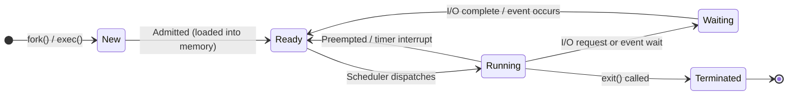
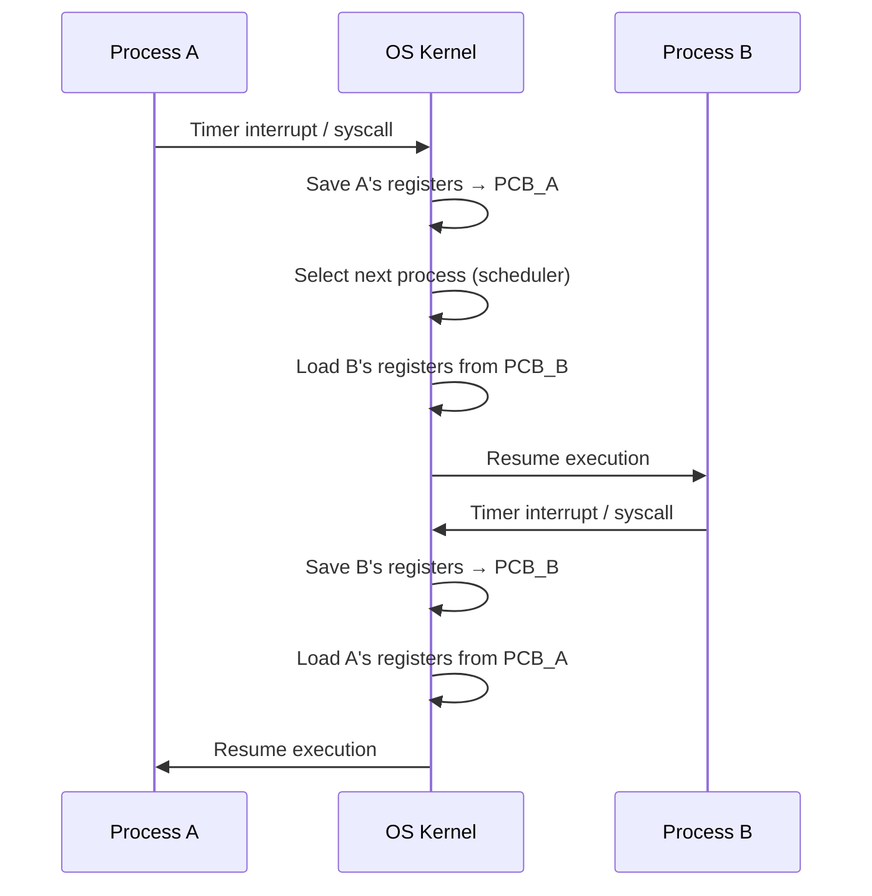
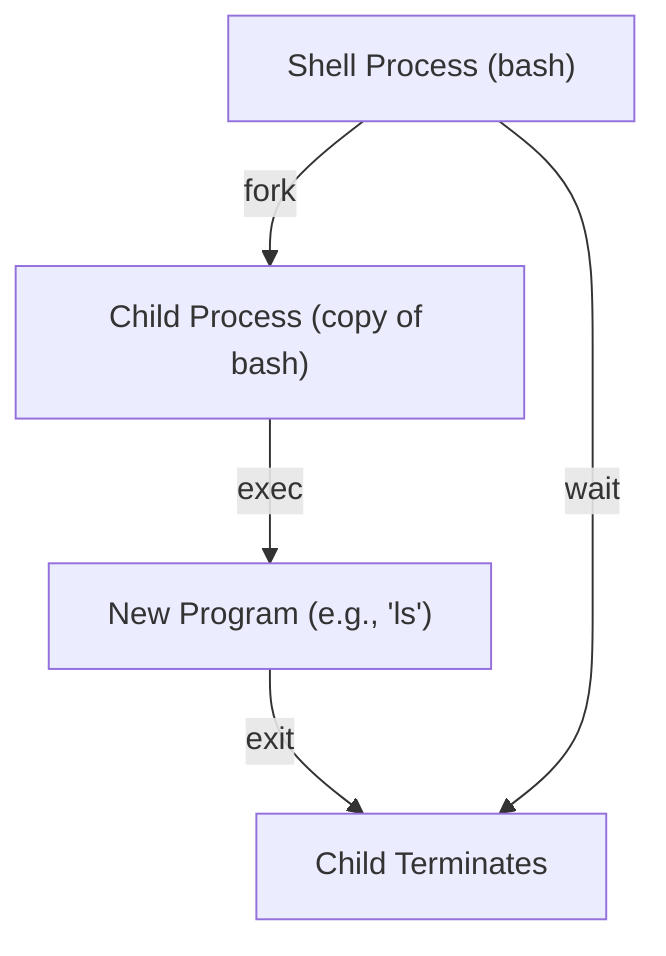

# OS: Process Management

A **process** is a program in execution — it includes the program code, current activity
(program counter, registers), stack, heap, and data section. Understanding processes is
foundational to everything else in OS: scheduling, IPC, concurrency.

## 1. Process vs. Program

| Concept | Definition |
|---|---|
| **Program** | A passive entity — executable file on disk |
| **Process** | An active entity — program loaded into memory and executing |
| **Thread** | A unit of execution within a process (shared address space) |

One program can spawn multiple processes (e.g., Chrome spawns a process per tab).

---

## 2. Process Lifecycle (State Machine)



### State Definitions

| State | Description |
|---|---|
| **New** | Process is being created |
| **Ready** | In memory, waiting for CPU time |
| **Running** | Instructions are being executed on a CPU |
| **Waiting** (Blocked) | Waiting for I/O or an event (not using CPU) |
| **Terminated** | Process has finished; OS is cleaning up |

:::note Why "Waiting" exists
When a process requests disk I/O, it cannot use the CPU while waiting (I/O is ~1,000× slower
than CPU). Moving it to Waiting state lets the scheduler give the CPU to a Ready process
instead of wasting cycles in a busy-wait loop. This is **overlapping CPU and I/O**.
:::

---

## 3. Process Control Block (PCB)

The OS maintains a **PCB** (Process Control Block) — a kernel data structure storing all
information about a process. In Linux, this is `struct task_struct` in `<linux/sched.h>`.

```
┌─────────────────────────────────┐
│         Process Control Block   │
├─────────────────────────────────┤
│  PID (Process ID)               │
│  Process State                  │
│  Program Counter                │
│  CPU Registers (saved on switch)│
│  CPU Scheduling Info (priority) │
│  Memory Management Info         │
│  I/O Status (open files, etc.)  │
│  Accounting (CPU time used)     │
│  Parent PID (PPID)              │
└─────────────────────────────────┘
```

You can inspect a process's info in Linux:

```bash
# Show process info
cat /proc/<PID>/status

# Show memory map
cat /proc/<PID>/maps

# Show open file descriptors
ls -la /proc/<PID>/fd
```

---

## 4. Context Switching

A **context switch** occurs when the CPU switches from one process to another.
The OS must save the current process's state into its PCB and load the next process's state.



**Cost of context switching:**
- Direct cost: saving/restoring registers (~100 ns on modern hardware)
- Indirect cost: **cache pollution** — the new process has cold caches

This is why too many processes or too-short time quanta hurt performance.

---

## 5. Process Creation: `fork()` and `exec()`

In Unix/Linux, processes are created using the `fork()` + `exec()` pattern.

### `fork()` — Clone the current process

```c
#include <stdio.h>
#include <unistd.h>
#include <sys/types.h>

int main() {
    pid_t pid = fork();  // Create child process

    if (pid < 0) {
        // Error
        fprintf(stderr, "Fork failed\n");
        return 1;
    } else if (pid == 0) {
        // CHILD process: fork() returns 0
        printf("Child PID: %d, Parent PID: %d\n", getpid(), getppid());
    } else {
        // PARENT process: fork() returns child's PID
        printf("Parent PID: %d, Child PID: %d\n", getpid(), pid);
    }

    return 0;
}
```

**After `fork()`:**
- Child is an exact copy of parent (code, data, heap, stack)
- They run in separate address spaces — changes in child don't affect parent
- Linux uses **Copy-on-Write (COW)** — pages are shared until one process writes, then copied

### `exec()` — Replace current process image

```c
#include <stdio.h>
#include <unistd.h>

int main() {
    pid_t pid = fork();

    if (pid == 0) {
        // In child: replace this process with 'ls -la'
        char *args[] = { "ls", "-la", NULL };
        execvp("ls", args);

        // If exec() returns, it failed
        perror("exec failed");
    } else {
        // Parent waits for child to finish
        wait(NULL);
        printf("Child finished\n");
    }

    return 0;
}
```



:::tip fork + exec is the universal pattern
Every time you run a command in a shell, the shell `fork()`s itself, then the child
`exec()`s the command. The shell `wait()`s for the child to finish. This is how
every Unix process is created.
:::

---

## 6. Zombie and Orphan Processes

| Type | Cause | Problem |
|---|---|---|
| **Zombie** | Child exits but parent hasn't called `wait()` | PCB stays in memory; wastes PID |
| **Orphan** | Parent exits before child | Child is re-parented to `init` (PID 1) |

```bash
# View zombie processes
ps aux | grep 'Z'

# Check process tree
pstree -p
```

---

## 7. Key System Calls

| System Call | Purpose |
|---|---|
| `fork()` | Create a child process |
| `exec()` | Replace process image with new program |
| `wait()` / `waitpid()` | Wait for child to terminate |
| `exit()` | Terminate current process |
| `getpid()` | Get current process ID |
| `kill()` | Send signal to a process |

---

## Common Mistakes

:::danger Mistake: Forgetting `wait()` creates zombies
If a parent never calls `wait()` for its children, zombie processes accumulate
and eventually exhaust the PID table. Always `wait()` for children.
:::

:::warning Mistake: Assuming fork() shares memory
After `fork()`, child and parent have **separate address spaces**. Writing to a variable in
the child does NOT affect the parent. Use pipes, shared memory, or signals for IPC.
:::

---

## Summary

```
fork() → copies process
exec() → replaces process image
wait() → parent blocks until child exits
exit() → terminates process, notifies parent
```

Process states: **New → Ready → Running ↔ Waiting → Terminated**

The PCB is the OS's representation of a process — it contains everything needed to
pause and resume execution.

## Related Notes

- [Memory Management](/docs/operating-systems/memory-management) — virtual memory, paging
- [Scheduling Algorithms](/docs/operating-systems/scheduling-algorithms) — how the Ready queue is managed
- [Concurrency & Deadlocks](/docs/operating-systems/concurrency-deadlocks) — threads, mutexes, semaphores
- [Linux: Process Management](/docs/linux/process-management) — practical Linux commands
